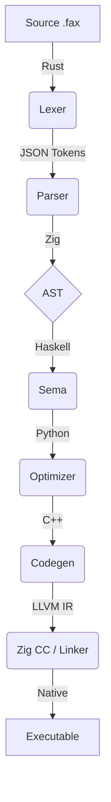

# 📠 Fax-lang

> **The Polyglot Compiler Experiment.**  
> A high-performance, modular language system where every compilation stage is a showcase of modern systems programming.

[](https://github.com/Luvion1/Fax/actions/workflows/ci.yml)
[](https://github.com/Luvion1/Fax/releases/tag/v0.0.1-alpha)
[]()
[]()
[](./LICENSE)

---

## 🚀 Overview

Fax is not just a language; it's a multi-language orchestration. By leveraging the strengths of **Rust, Zig, Haskell, C++, and Python**, Fax achieves a unique balance between safety, mathematical correctness, and raw performance.

### Key Pillars
- **🏗️ Modular by Design**: Every stage (Lexer to Codegen) is an independent micro-service communicating via structured JSON.
- **💎 Fgc Runtime**: A state-of-the-art ZGC-inspired Garbage Collector written in Zig.
- **🛡️ Type Safe**: Semantic analysis powered by Haskell's rigorous type system.
- **⚡ LLVM Powered**: Generates highly optimized native machine code.

---

## 🛠️ Architecture at a Glance



| Component | Language | Role |
| :--- | :--- | :--- |
| **Lexer** | 🦀 Rust | High-speed tokenization & UTF-8 handling. |
| **Parser** | ⚡ Zig | Memory-efficient Recursive Descent parsing. |
| **Sema** | λ Haskell | Recursive type checking & semantic validation. |
| **Optimizer**| 🐍 Python | Graph-based AST transformations. |
| **Codegen** | ⚙️ C++ | LLVM IR generation & Stack Map emission. |
| **Runtime** | ⚡ Zig | **Fgc**: Colored, Mark-Relocate Garbage Collector. |

---

## 📦 Getting Started

### 1. Prerequisites
Ensure you have the following toolchains installed:
- **Rust** (Cargo)
- **Zig** (0.15.2+)
- **Haskell** (GHC)
- **C++** (GCC/Clang)
- **Node.js** (for the Hub)

### 2. Installation
```bash
git clone https://github.com/fax-lang/fax
cd fax/faxc
npm install
```

### 3. Your First Program
Create `hello.fax`:
```fax
fn main() {
    print("Hello, the future of polyglot coding!")
}
```
Run it:
```bash
npx ts-node src/hub/pipeline.ts hello.fax
```

---

## 🗺️ Roadmap
- [x] Recursive Descent Parser in Zig.
- [x] Fgc (ZGC-style) Mark-Relocate runtime.
- [ ] **Next**: Trait system and Generic types.
- [ ] **Next**: Concurrency primitives (Goroutine-style).
- [ ] **Future**: Self-hosting (Fax written in Fax).

---

## 📄 Documentation
- [User Guide](docs/user_guide.md) - Learn how to code in Fax.
- [Internals Deep Dive](docs/internals/overview.md) - How the compiler works.
- [Fgc Architecture](docs/fgc_architecture.md) - Understanding the memory management.

---
*Built with ❤️ by the Fax-lang Team.*
