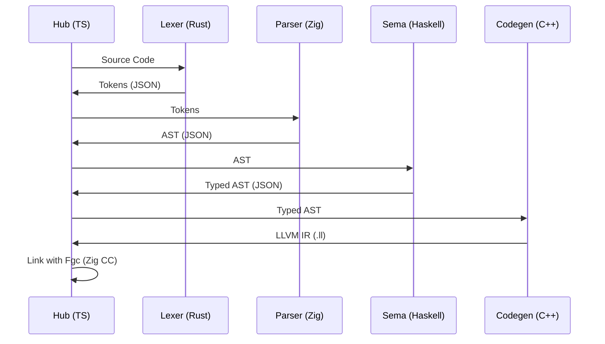

# Internal Architecture Overview

Welcome to the internal engineering documentation of Fax-lang. This section is intended for contributors and curious developers who want to understand how a polyglot compiler functions.

## The Polyglot Philosophy

Most compilers are written in a single language (Self-hosted). Fax breaks this tradition by choosing the **best tool for the job** at each stage:

- **Speed**: Rust (Lexer)
- **Safety & Logic**: Haskell (Sema)
- **Low-level Control**: Zig (Parser & Runtime)
- **Industry Standard**: C++ (Codegen)

## Data Flow Diagram

## Performance Considerations

Using JSON as an intermediate format introduces serialization overhead. To mitigate this:
1. We use **Fast JSON** libraries in every language (Serde in Rust, `nlohmann/json` in C++).
2. Data is passed via `stdout` pipes to avoid disk I/O latency.
3. Each component is a long-lived process in future versions (LSP/Daemon mode).

## Error Propagation

Errors are first-class citizens. When a component fails:
1. It prints a structured error to `stderr`.
2. The Hub captures the exit code.
3. The Hub formats the error for the user and terminates the pipeline immediately to prevent "cascade failures".

---
Next: Read about the [Fgc Runtime Architecture](../fgc_architecture.md).
